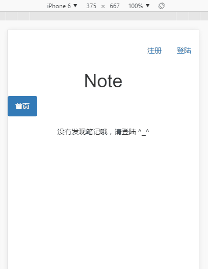
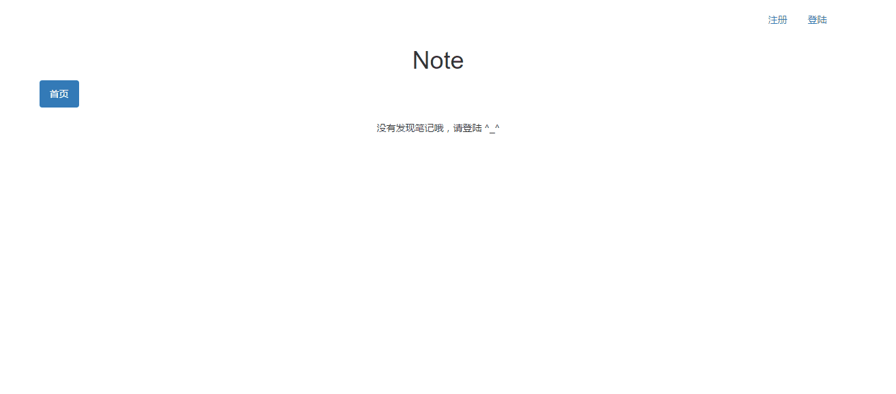

# 笔记（Note）

项目演示

```
* 项目暂时未上线哦，分别录制了PC端和移动端的演示动画。
* 项目已知问题有：添加和修改点击两次才执行（已修复），输入框不会自动对焦第一个
* 项目的排版不够整齐，以后再优化
```




### 项目进度

> 2017.03.12

1. 修复后端不能在IE下生成Cookie的问题
2. 修复点击按钮和修改按钮需要点击两次才执行的问题

> 2017.03.11

1. 用户的注册登陆，文章的增删改查已经完成
2. 注册用户默认生成一条提示性的笔记
3. 注册和登陆时候的密码改为password类型
4. 下一步主要完善相关的状态提示信息以及验证码的加入
5. 以及引入babel，eslint等前端构建工具
6. 接下来的时间更新不会那么频繁了，主要是去总结JS并且写总结
7. 用闭包对js文件进行了封装
8. 标签内的onclick全部转化为事件监听

src/js/javascript文件结构


```
 * ctrl   控制: 自调用的主代码
 * check  检查: 检查用户是否登陆
 * model  模板: 登陆注册的模拟弹窗
 * test   测试: 
 * 
 * ajax   数据: 通过XHR与后端交互并且返回结果
 * render 渲染: 对首屏数据进行渲染
 * hint   提示: 操作时候的状态信息
 * handle 处理: 登陆注册和修改编辑
```

> 2017.03.09

1. 实现了`登陆`、`注册`、`注销`的前后端交互
2. 实现了文章的`删除`、`修改`操作，基础功能只差添加了，还没想好怎么展示
3. 目前线上版本的是基于localstrorage的
4. 等这个基于前后端分离的功能完善了，就在线上测试
5. 下一步主要是完善前端状态提示信息
6. 后端安全性暂时未考虑，主要做基于后端数据的前端展示
7. 前端安全性打算对保存的内容进行标签转码，过滤危险标签
8. 代码健壮性有待优化
9. 密码使用MD5加密（暂时性）

目录结构

```
/src  开发目录
	/less
		styles.less
	/css
		styles.css
	/js
		javascript.js
	/img

/dist  线上目录
	/css
	/js
	/img

/api
	/note
		add.php  // 添加文章
		delete.php  // 删除文章
		modify.php  // 修改文章
		search.php  // 搜索文章
	/user
		login.php  // 处理用户登陆，成功则设置COOKIE标记登陆状态并刷新页面
		login_check.php  // 检查用户是否登陆，未登录停止执行后续语句
		register.php  // 处理用户注册，注册成功设置COOKIE刷新页面
		forget.php  // 忘记密码（验证邮箱）
		password.php  // 修改密码（需要输入原密码）

/theme
	/localstorage  // 初期版本，笔记主要存储在本地存储，页面即开即用

conn.php  // 数据库连接文件
test.js  // js调试文件
index.html  // 主文件
```

> 2017.03.08

1. 更新了密码修改模块。
2. 完成了基于后端数据的前端首页展示
3. 根据鼠标悬浮状态按需显示修改和删除按钮
4. 封装了登录和注册的模态，通过传参调用
5. 登陆显示用户信息，未登陆显示登陆按钮
6. 实现了页面的注册，登陆（注销页面暂时未完成）及访问自己的文章
7. 接下来要做的用户增删改查自己的笔记

> 2017.03.07

1. 用PHP返回JSON进行前后端分离，前端使用xhr获取数据
2. 后端API只剩忘记密码（这个打算先放一放）和修改密码未做完。明天把后端代码优化一下，接着就开始做前端的活了。是用原生JS，还是直接BS,JS一套上，还没有决定。或者用Vue。
3. 后端 REST API 清单

```
test.html  // 测试API的是否正常工作
conn.php  // 数据库连接文件
/api
	/note
		add.php  // 添加文章
		delete.php  // 删除文章
		modify.php  // 修改文章
		search.php  // 搜索文章
	/user
		login.php  // 处理用户登陆，成功则设置COOKIE标记登陆状态
		login_check.php  // 检查用户是否登陆
		register.php  // 处理用户注册
		forget.php  // 忘记密码（验证邮箱）
		password.php  // 修改密码（需要输入原密码）
```

### 在线预览

为了方便对项目进行预览，代码放在了个人网站。 [Note在线预览](http://berg-lab.com/demo/note/)

### 项目重构

为了更好的学习工具链，将逐步对项目进行重构。通过实践来加深对工具链的理解。

> 目前的项目结构

```

前端 > 页面（HTML） / 脚本（JS Localstorage API） / 样式（CSS） / 工具（Gulp）

```


> 逐步转换的结构

```

后台 > PHP
前端 > 页面（Pug） / 脚本（jQuery store.js） / 样式（Less） / 工具（Gulp）

```